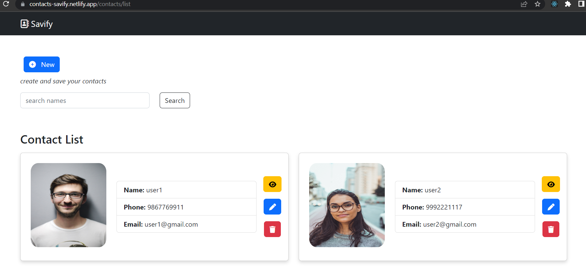
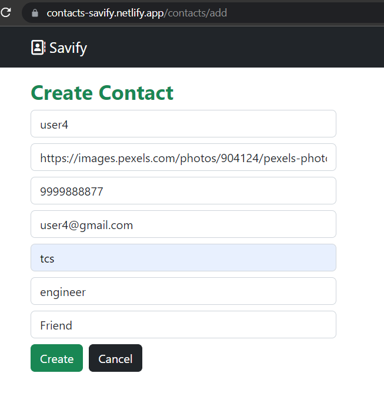
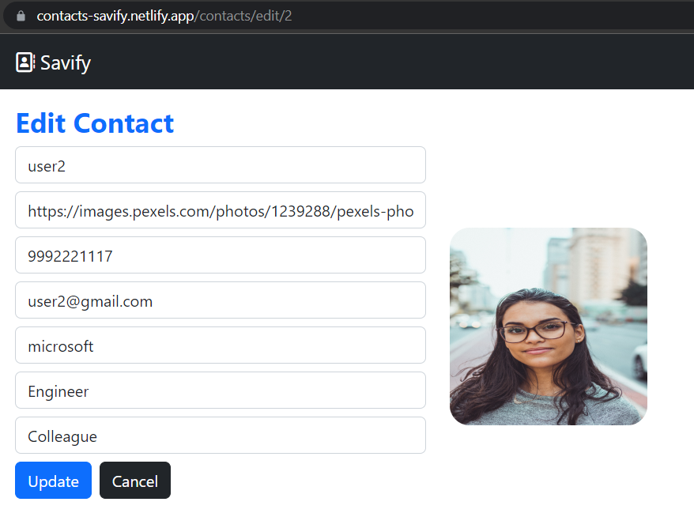
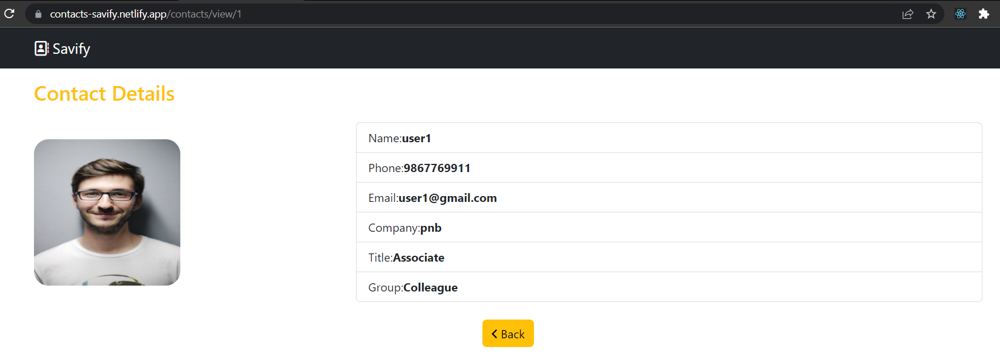

# Savify

## :page_facing_up: Description

- savify is the contacts saving app which helps users to manage there contacts

## 🚀 deployed on [netlify](https://app.netlify.com/)

- [https://contacts-savify.netlify.app/](https://contacts-savify.netlify.app/)

## 🛠 Installation and setup

1. Clone the repo to your local machine.
2. Install the required dependency for server using :

   ```javascript
   npm install
   ```

3. Start the dev server using :

   ```javascript
   npm run dev
   ```

## ⚙ Tools and Technologies used

- [React.js](https://react.dev/)
- [Axios](https://axios-http.com/)
- [fontawesome icons](https://fontawesome.com/search?o=r&m=free)
- [react-router-dom](https://reactrouter.com/en/main)
- [bootstrap](https://getbootstrap.com/)

## 🏎 Creating production built

1. Create a production ready react app using the command :

   ```javascript
   npm run build
   ```

## ✨ Features

Users creating the contacts using this platform enjoy the following features

- [x] Users can create the contact
- [x] Users can edit the contact
- [x] Users can view contact
- [x] Users can delete contact
- [x] Users can search the contacts by users name
- [x] Users can see all the contacts listed at one place

## Pages

- contact list page



- create contact page



- edit contact page



- view contact page


